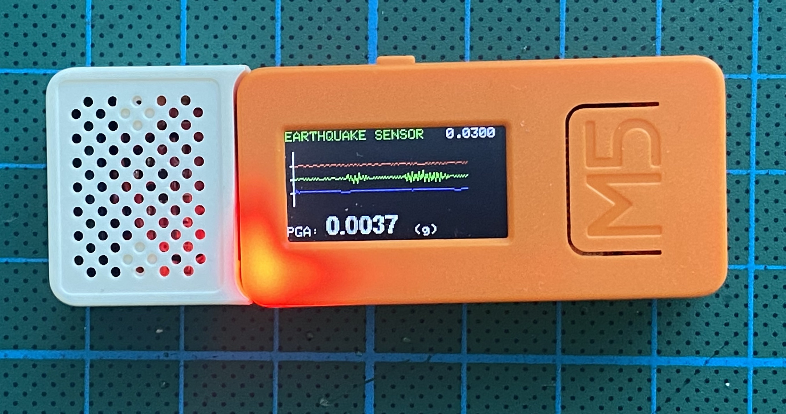
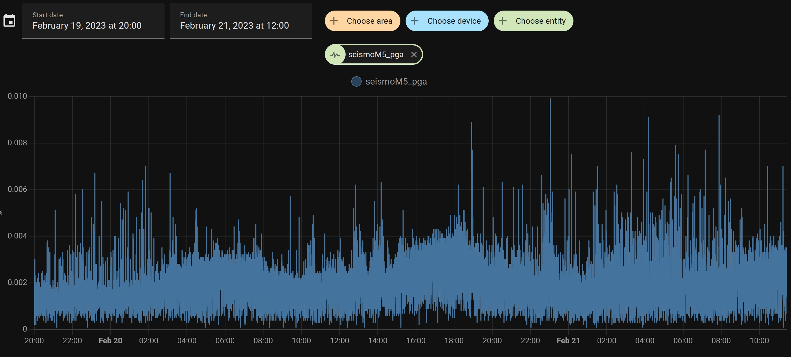

# seismoM5
<p align="center">

</p>
SeismoM5 is an Earthquake Sensor Implementation on M5StickC, using its own MPU6886 accelerometer. Although MPU6886 in M5StickC is a bit on the noisy side; disabling Gyro and using an accel calibration helped a little. The properties of this project is:

- Calibrate MPU6886 accelerometer and use calibration results as offsets.
- Use DLPF - 5 Hz.
- Use MQTT and send data, only when an earthquake happens.
- Draw X,Y,Z accel results on M5stickC screen as graph, only when an earthquake happens.
- Show PGA always.
- Emergency alerts; Red Led and SPK HAT sound warning during an earthquake.

<p align="center">

</p>
  
## Seismology

I am nowhere near being a Seismologist or I understand anything about. It is just that I live in an overly active Seismic zone. The idea came up for adding an earthquake sensor to the smart home; to shut gas valves off and open some rolling shutters for an escape route during an earthquake.

So i tried some signal algorithms to get the most effective earthquake trigger mechanism possible. There are 2 triggering methods; PGA threshold trigger and STA/LTA trigger method.

``
pga = sqrt(x_vector_mag * x_vector_mag + y_vector_mag * y_vector_mag + z_vector_mag * z_vector_mag)*scale_factor;
``

PGA gives intensity too, but i do not know how reliable that is.

## Usage

This is a Platformio code. First of all, the user needs to fill WiFi and MQTT server details in main.cpp. Other parameters like Seismic, MPU calibration or screen properties can be changed for best fit after some tests and trials. Also for M5stickC select **env:M5stick-c** and for M5StickC-Plus select **env:M5stick-c-plus** in Platformio.

Button A of M5stickC toggles MQTT server connection. If bottom right corner of the screen shows MQTT, the server is connected.

Button B of M5stickC resets M5StickC for recalibration purposes.

  


## MQTT

### Availability: seismoM5/status

"**online**" or "**offline**"


### State: seismoM5/state

**INIT_MPU:** Init MPU6886.

**WAIT:** Wait for 10 seconds, to get ready to keep M5StickC steady.

**CALIBRATION:** MPU6886 Accelerator find offsets and send to MPU registers for calibration. Might take up to 1 minute.

**LISTENING:** Everything is ready and listening for earthquakes.

**EARTHQUAKE:** Earthquake is happening


### Events: seismoM5/event

**{"x":"-85","y":"-1097","z":"16305","pga":"0.0007"}**   <sup>Sample</sup>

Momentary x,y,z parameters and PGA in (g). Only send while an earthquake occurs.

PGA results can be compared with the values in:

[PGA Correlation with the Mercalli scale](https://en.wikipedia.org/wiki/Peak_ground_acceleration#Correlation_with_the_Mercalli_scale)

or

[Japan Meteorological Agency seismic intensity scale](https://en.wikipedia.org/wiki/Japan_Meteorological_Agency_seismic_intensity_scale#Scale_overview)


### PGA Trigger: seismoM5/pga_trigger

Displays PGA trigger value for the earthquake alert. The first time SeismoM5 works after the first upload, the default PGA Trigger value will be 0.025 g. On screen, top right corner shows the PGA Trigger value.


### Commands: seismoM5/command

Should be send in JSON format as follows: 
```
{
    "pga_trigger": 0.0150,
    "update": false,
    "reset": false,
    "speaker_enable" : true,
    "lcd_brightness" : 7,
    "continuous_graph" : false,
    "update_period" : 30
}
```
There is no need to send this full message, any item can be send standalone or together with any other item.

**"pga_trigger" : *float***  - Changes the PGA Trigger. If the PGA Trigger is ever changed, SeismoM5 saves this value permanently and use it from then on even after you reset SeismoM5.

**"reset" : *bool***  - If true, resets M5StickC for recalibration purposes.

**"update" : *bool***  - If true, sends a one time event message update request.

**"speaker_enable" : *bool***  - If true, enables the SPK HAT Speaker, false disables it.

**"lcd_brightness" : *int***  - Sets the standby LCD brightness, should be between 7-15, 15 being the brightest.

**"continuous_graph" : *bool***  - If true, draws the graph continuously, even when there is no earthquake.

**"update period" : *int***  - Sets the update period of event mqtt message to be send, even there is no earthquake, in seconds.


## SeismoM5 Web Page

<p align="center">

</p>

You can connect to SeismoM5 either with http://seismom5.local address or its IP address to monitor or change:

- Change PGA Trigger Value

- Change standby LCD Brightness

- Change the update period of event mqtt message to be send, even there is no earthquake, in seconds

- Use STA/LTA Method for triggering, this disables PGA Triggering.

- Enable/Disable Speaker

- Enable/Disable continuous graph

- Change Logging Type (Serial, WebSerial, Both or None)

- WebSerial Output

- Recalibrate MPU

- Restart SeismoM5 ESP32

## OTA Firmware Upload

The first upload should be a Serial connection upload. After that, these 2 lines can be uncommented (delete ";" characters) from platformio.ini file for OTA firmware uploading.

```
;upload_port = seismoM5.local
;upload_protocol = espota
```

## Master / Slave Configuration for more reliable triggers

Although MPU6886 on M5StickC is not very much noisy, once in a while, the pga jumps for 5-10 seconds above trigger (frequency is like once or twice every 1-2 days, up to 0.0150 g according to my results). So i also added a Master/Slave Configuration which requires two M5Sticks. If the Master stick triggers an earthquake, it also checks the Slave Stick and if it also has a trigger, then the Master changes its state to "EARTHQUAKE" only then...

**Configuration:**

1. In order to upload "SLAVE" first, uncomment "//#define SLAVE" and make it "**#define SLAVE**" in config.h file.

2. Upload the SLAVE M5StickC. The SLAVE is ready.

3. Comment the "#define SLAVE" line back to "**//#define SLAVE**" in config.h file.

4. Upload the MASTER M5StickC.

5. Go to the Web Page of MASTER M5StickC.

6. Check "Master" checkbox and save it. If you don't check the "Master" checkbox on web page, this stick will still act as a standalone SeismoM5.

7. Just check the /state of MASTER Stick for earthquakes, not the SLAVE!


## Mounting

Seismologists mount accelerometer based seismic sensors to the lowest point of the structure, close to the ground as possible. However, since this is an amateur earthquake sensor, i mount it as high as possible in the house, on a wall. You can use the in-built magnets of M5StickC to attach it to a metal surface but as i experienced they are not so strong and may fall off during an earthquake. Double sided adhesive mounting tapes can also work, but make sure the wall paint is a stickable one. All in all, it should be mounted very firm and be careful about the x,y,z axis of the accelerometer; use a carpenters level if required. 

** Due to the screen position, x axis is used as z axis and z axis is used as x axis within the code.

## Installation

1. Download VSCode from https://code.visualstudio.com/download and install it.
2. Open VSCode and press "Extensions" button (which has small squares icon) which is on the left vertical bar of the screen.
3. In "Search extensions in Marketplace"  edit box, write "Platformio" and find and install Platformio IDE on VSCode.
4. Wait for some time for platformio to be installed completely.

This was the Compiler installation part. Now we will open and upload SeismoM5 to our stick.
1. From https://github.com/febalci/seismoM5 address Press the Green "Code" Button on this page and select "Download ZIP". Download and unzip this into a folder.
2. From VSCode, Press the Alien head on the left vertical bar on the screen. This is PIO (PlatformIO).
3. Select "Open". PIO Home Page will come up. Press "Open Project" button from this page. Select the Folder of unzipped SeismoM5 and press open.
4. Wait for some time for PIO to open and set everything up for this project.
5. From the bottom blue bar of VSCode, click on where it writes "Default (seismom5)" and select "env:m5stick-c-plus" or "env:m5stick-c" from there.
6. Now we will set the config parameters. Click "Explorer" on the left vertical band and open the "config.h" file under src folder.
7. In this file you need to enter these parameters:
```
//WiFi Parameters
#define WIFI_SSID "XXXXXXXX"
#define WIFI_PASS "XXXXXXXX"

#define MQTT_SERVER "XXXXXXXX"
#define MQTT_PORT 1883
#define MQTT_USER "XXXXXXXX"
#define MQTT_PASS "XXXXXXXX"
```
8. Everything is ready to upload now. Connect your M5stick to a usb port on your computer. On the bottom blue bar find the arrow icon pointing right (Tooltip: PlatformIO Upload). Click it and wait for it to upload to M5Stick.

## Home Assistant Integration

<p align="center">

</p>

Here is the configuration that you should add to configuration.yaml:

```
mqtt:
  sensor:
    - name: "seismoM5_online"
      state_topic: "seismoM5/status"
      icon: mdi:pulse
    - name: "seismoM5_state"
      state_topic: "seismoM5/state"
      availability:
        - topic: "seismoM5/status"
          payload_available: "online"
          payload_not_available: "offline"
      icon: mdi:pulse
    - name: "seismoM5_pga"
      availability:
        - topic: "seismoM5/status"
          payload_available: "online"
          payload_not_available: "offline"
      state_topic: "seismoM5/event"
      value_template: "{{ value_json.pga }}"
      icon: mdi:pulse
      unit_of_measurement: "g"
    - name: "seismoM5_x"
      availability:
        - topic: "seismoM5/status"
          payload_available: "online"
          payload_not_available: "offline"
      state_topic: "seismoM5/event"
      value_template: "{{ value_json.x }}"
      icon: mdi:pulse
      unit_of_measurement: "g"
    - name: "seismoM5_y"
      availability:
        - topic: "seismoM5/status"
          payload_available: "online"
          payload_not_available: "offline"
      state_topic: "seismoM5/event"
      value_template: "{{ value_json.y }}"
      icon: mdi:pulse
      unit_of_measurement: "g"
    - name: "seismoM5_z"
      availability:
        - topic: "seismoM5/status"
          payload_available: "online"
          payload_not_available: "offline"
      state_topic: "seismoM5/event"
      value_template: "{{ value_json.z }}"
      icon: mdi:pulse
      unit_of_measurement: "g"
  button:
    - unique_id: seismom5_reset_btn
      name: "Restart SeismoM5"
      command_topic: "seismoM5/command"
      payload_press: "{\"reset\": true }"
      availability:
        - topic: "seismoM5/status"
      qos: 0
      retain: false
      entity_category: "config"
      device_class: "restart"
```

and the earthquake warning automation for a "pushover" app on smart phone notification:

```
- alias: Earthquake
  trigger:
  - platform: state
    entity_id: sensor.seismom5_state
    from: "LISTENING"
    to: "EARTHQUAKE"
  action:
  - service: notify.pushover
    data_template:
      message: >
        DEPREM !!!
```

offline warning automation for a "pushover" app on smart phone notification:

```
- alias: SeismoM5 Online Check
  trigger:
  - platform: state
    entity_id: sensor.seismom5_state
    to: "unavailable"
  condition:
  - condition: template
    value_template: '{{(as_timestamp(now()) - as_timestamp(state_attr("automation.seismom5_online_check", "last_triggered") | default(0)) | int > 600 )}}'
  action:
  - service: notify.pushover
    data_template:
      message: >
        SeismoM5 Offline...
  id: "seismom5_online_check"
```

Lovelace cards for the sensors
```
type: grid
square: false
columns: 1
cards:
  - type: entity
    entity: sensor.seismom5_pga
  - type: entity
    entity: sensor.seismom5_state
    name: SeismoM5 State
  - type: entity
    entity: sensor.seismom5_online
  - type: logbook
    entities:
      - sensor.seismom5_state
  - show_name: true
    show_icon: true
    type: button
    tap_action:
      action: toggle
    entity: button.restart_seismom5
    icon_height: 30px
```
