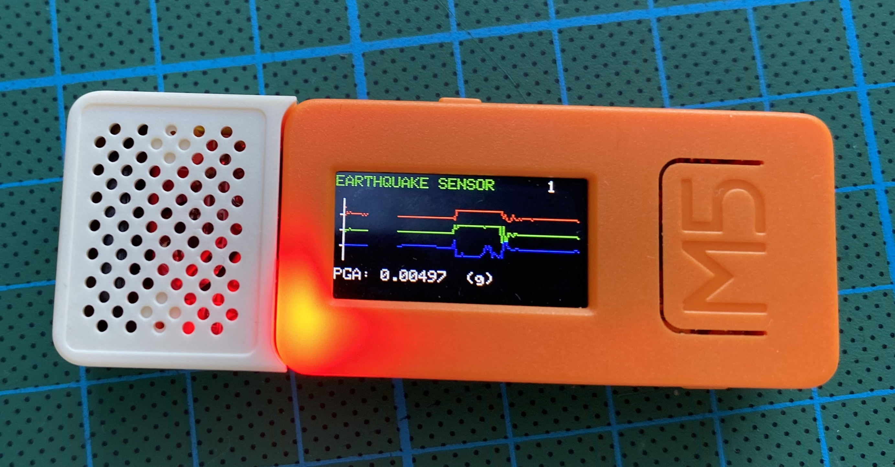
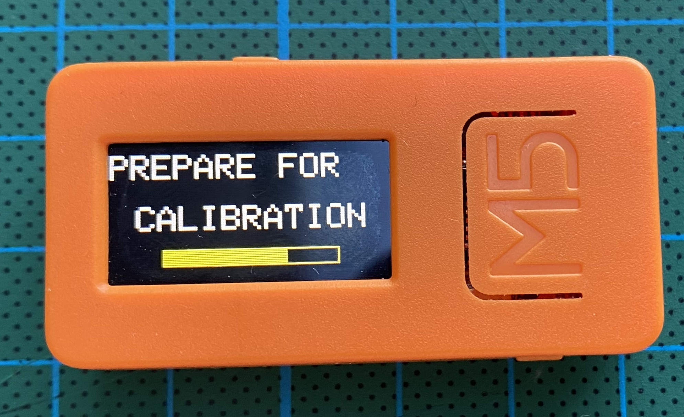
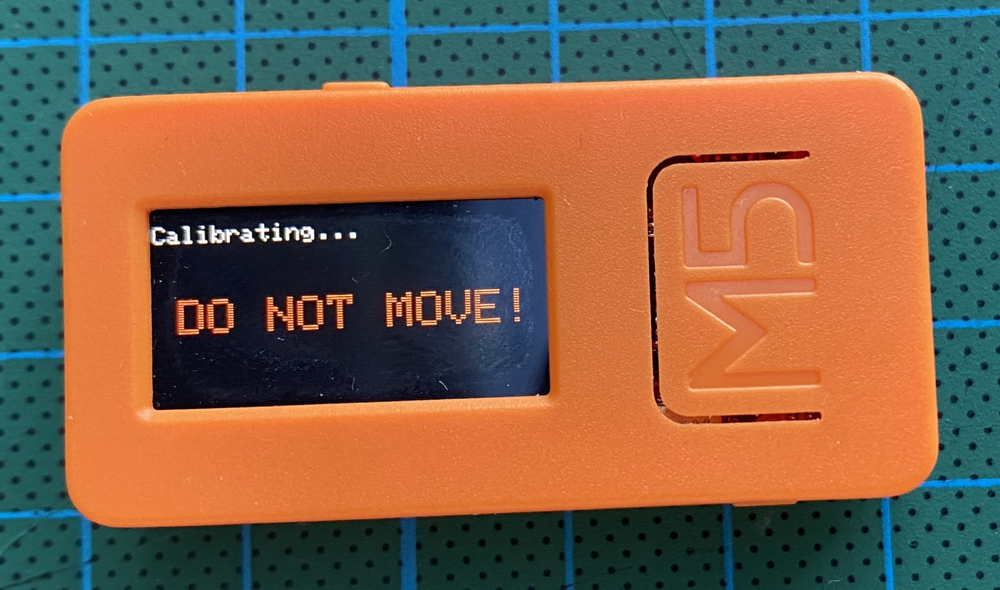
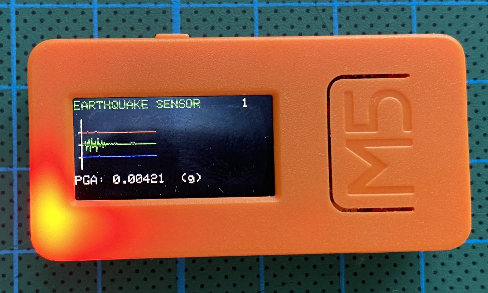

# seismoM5
SeismoM5 is an Earthquake Sensor Implementation on M5StickC, using its own MPU6886 accelerometer. Although MPU6886 in M5StickC is a bit on the noisy side; disabling Gyro and using an accel calibration helped a little. The properties of this project is:

- Calibrate MPU6886 accelerometer and use calibration results as offsets.
- Use DLPF - 5 Hz.
- Use MQTT and send data, only when an earthquake happens.
- Draw X,Y,Z accel results on M5stickC screen as graph, only when an earthquake happens.
- Show PGA always.
- Emergency alerts; Red Led and SPK HAT sound warning during an earthquake.

<p align="center">

</p>
  
## Seismology

I am nowhere near being a Seismologist or I understand anything about. It is just that I live in an overly active Seismic zone. The idea came up for adding an earthquake sensor to the smart home; to shut gas valves off and open some rolling shutters for an escape route during an earthquake.

So i tried some signal algorithms to get the most effective earthquake trigger mechanism possible. Among these, STA/LTA method was very close to get rid of the noise and unwanted man made noises and peaks. However, the test results were not succesfull for me. So i opted out for a simple PGA calculation:

``
pga = sqrt(x_vector_mag * x_vector_mag + y_vector_mag * y_vector_mag + z_vector_mag * z_vector_mag)*scale_factor;
``

The triggering mechanism is, if PGA exceeds limit, that is an earthquake. PGA gives intensity too, but i do not know how reliable that is.

## Usage

This is a Platformio code. First of all, the user needs to fill WiFi and MQTT server details in main.cpp. Other parameters like Seismic, MPU calibration or screen properties can be changed for best fit after some tests and trials. Also for M5stickC select **env:M5stick-c** and for M5StickC-Plus select **env:M5stick-c-plus** in Platformio.

Button A of M5stickC toggles MQTT server connection. If bottom right corner of the screen shows MQTT, the server is connected.

Button B of M5stickC resets M5StickC for recalibration purposes.

  


## MQTT

### Availability: m5seismo/status

"**online**" or "**offline**"


### State: m5seismo/state

**INIT_MPU:** Init MPU6886.

**WAIT:** Wait for 10 seconds, to get ready to keep M5StickC steady.

**CALIBRATION:** MPU6886 Accelerator find offsets and send to MPU registers for calibration. Might take up to 1 minute.

**LISTENING:** Everything is ready and listening for earthquakes.

**EARTHQUAKE:** Earthquake is happening


### Events: m5seismo/event

**{"x":"-85","y":"-1097","z":"16305","pga":"0.0007"}**   <sup>Sample</sup>

Momentary x,y,z parameters and PGA in (g). Only send while an earthquake occurs.

PGA results can be compared with the values in:

[PGA Correlation with the Mercalli scale](https://en.wikipedia.org/wiki/Peak_ground_acceleration#Correlation_with_the_Mercalli_scale)

or

[Japan Meteorological Agency seismic intensity scale](https://en.wikipedia.org/wiki/Japan_Meteorological_Agency_seismic_intensity_scale#Scale_overview)


### PGA Trigger: m5seismo/pga_trigger

Displays PGA trigger value for the earthquake alert. The first time SeismoM5 works after the first upload, the default PGA Trigger value will be 0.025 g. On screen, top right corner shows the PGA Trigger value.


### Commands: m5seismo/command

Should be send in JSON format as follows: 
```
{
    "pga_trigger": 0.0150,
    "update": false,
    "reset": false,
    "speaker_enable" : true,
    "lcd_brightness" : 7,
    "continuous_graph" : false,
    "update_period" : 30
}
```
There is no need to send this full message, any item can be send standalone or together with any other item.

**"pga_trigger" : *float***  - Changes the PGA Trigger. If the PGA Trigger is ever changed, SeismoM5 saves this value permanently and use it from then on even after you reset SeismoM5.

**"reset" : *bool***  - If true, resets M5StickC for recalibration purposes.

**"update" : *bool***  - If true, sends a one time event message update request.

**"speaker_enable" : *bool***  - If true, enables the SPK HAT Speaker, false disables it.

**"lcd_brightness" : *int***  - Sets the standby LCD brightness, should be between 7-15, 15 being the brightest.

**"continuous_graph" : *bool***  - If true, draws the graph continuously, even when there is no earthquake.

**"update period" : *int***  - Sets the update period of event mqtt message to be send, even there is no earthquake, in seconds.


## SeismoM5 Web Page

You can connect to SeismoM5 with its IP address to monitor or change:

- WebSerial Output

- OTA Firmware Update

- Change PGA Trigger Value

- Enable/Disable Speaker

- Change standby LCD Brightness

- Enable/Disable continuous graph

- Change the update period of event mqtt message to be send, even there is no earthquake, in seconds

- Restart SeismoM5 for Calibration or any other purpose

- Change Logging Type (Serial, WebSerial, Both or None)


## Mounting

Seismologists mount accelerometer based seismic sensors to the lowest point of the structure, close to the ground as possible. However, since this is an amateur earthquake sensor, i mount it as high as possible in the house, on a wall. You can use the in-built magnets of M5StickC to attach it to a metal surface but as i experienced they are not so strong and may fall off during an earthquake. Double sided adhesive mounting tapes can also work, but make sure the wall paint is a stickable one. All in all, it should be mounted very firm and be careful about the x,y,z axis of the accelerometer; use a carpenters level if required. 

** Due to the screen position, x axis is used as z axis and z axis is used as x axis within the code.

## Home Assistant Integration

Here is the configuration that you should add to configuration.yaml:

```
mqtt:
  sensor:
    - name: "seismoM5_state"
      state_topic: "m5seismo/state"
      availability:
        - topic: "m5seismo/status"
          payload_available: "online"
          payload_not_available: "offline"
      icon: mdi:pulse
    - name: "seismoM5_pga"
      availability:
        - topic: "m5seismo/status"
          payload_available: "online"
          payload_not_available: "offline"
      state_topic: "m5seismo/event"
      value_template: "{{ value_json.pga }}"
      icon: mdi:pulse
      unit_of_measurement: "g"

  button:
    - unique_id: seismom5_reset_btn
      name: "Restart SeismoM5"
      command_topic: "m5seismo/command"
      payload_press: "{\"reset\": true }"
      availability:
        - topic: "m5seismo/status"
      qos: 0
      retain: false
      entity_category: "config"
      device_class: "restart"
```

and the earthquake warning automation for a pushover smart phone notification:

```
- alias: Earthquake
  trigger:
  - platform: state
    entity_id: sensor.seismom5_state
    from: "LISTENING"
    to: "EARTHQUAKE"
  action:
  - service: notify.pushover
    data_template:
      message: >
        EARTHQUAKE HAPPENING !!!
```

offline warning automation for a pushover smart phone notification:

```
- alias: SeismoM5 Online Check
  trigger:
  - platform: state
    entity_id: sensor.seismom5_state
    to: "unavailable"
  action:
  - service: notify.pushover
    data_template:
      message: >
        SeismoM5 Offline...
```
